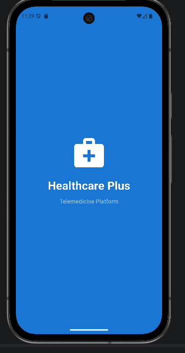
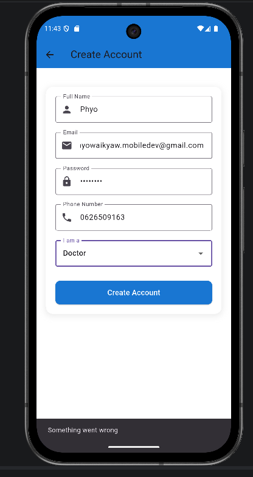
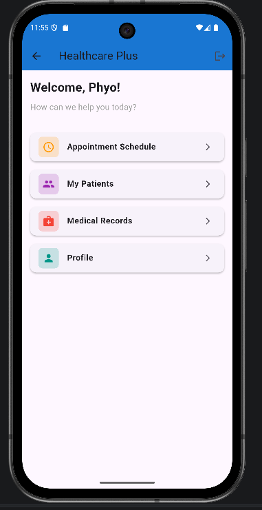
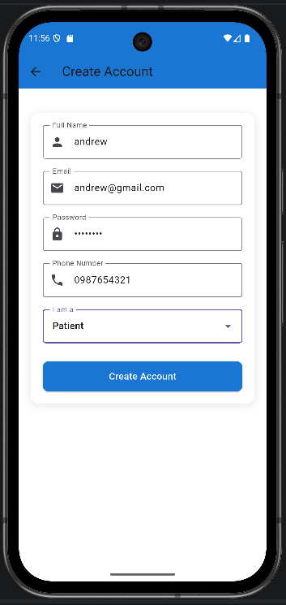
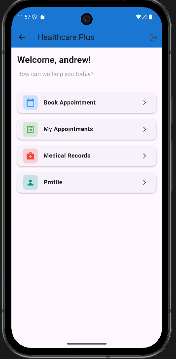
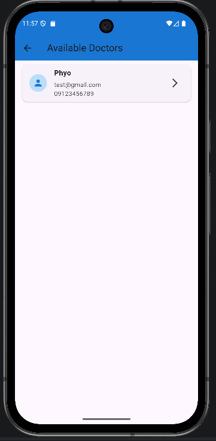

# 🏥 Healthcare Plus — Telemedicine Flutter App

A complete telemedicine mobile application built with Flutter & Firebase. Supports dual roles — **Patient** and **Doctor** — with real-time Firestore data, Firebase Authentication, and a clean Material UI.

> *"Your Health, Our Priority"*

---

## 📸 Screenshots

<table>
<tr>
<td align="center">

<br/><sub>Splash Screen</sub>
</td>
<td align="center">

<br/><sub>Doctor Register</sub>
</td>
<td align="center">

<br/><sub>Doctor Dashboard</sub>
</td>
</tr>
<tr>
<td align="center">

<br/><sub>Patient Register</sub>
</td>
<td align="center">

<br/><sub>Patient Dashboard</sub>
</td>
<td align="center">

<br/><sub>Available Doctors</sub>
</td>
</tr>
</table>

---

## ✨ Features

- 🔐 **Firebase Authentication** — Email & Password login/register
- 👤 **Dual Role System** — Patient & Doctor with different dashboards
- 🏥 **Patient Dashboard** — Book appointments, view appointments, medical records
- 👨‍⚕️ **Doctor Dashboard** — Appointment schedule, patient list
- 🩺 **Doctor List** — Real-time list of available doctors via Firestore stream
- 💾 **Firestore Integration** — User data stored & retrieved in real-time
- 🎨 **Clean Material UI** — Blue-themed healthcare design

---

## 🗂️ Project Structure

```
lib/
├── pages/
│   ├── splash_screen.dart     # Splash with 2s delay → Login
│   ├── login_page.dart        # Firebase Auth login
│   ├── register_page.dart     # Register with role selection
│   ├── home_page.dart         # Role-based dashboard
│   └── doctor_list_page.dart  # Real-time doctor list (Firestore stream)
└── main.dart                  # App entry + Firebase init
```

---

## 🛠️ Tech Stack

| Category | Technologies |
|----------|-------------|
| **Framework** | Flutter 3.x · Dart ≥ 3.0 |
| **Authentication** | Firebase Auth (Email/Password) |
| **Database** | Cloud Firestore |
| **UI** | Material Design 3 |
| **State** | `setState` (local state) |

---

## 🚀 Getting Started

### Prerequisites

- Flutter SDK `>=3.0.0`
- Firebase project with **Authentication** & **Firestore** enabled

### Setup

```bash
# Clone the repo
git clone https://github.com/phyowaikyaw-mobiledev/healthcare_plus.git
cd healthcare_plus

# Install dependencies
flutter pub get

# Add your google-services.json to android/app/
# Then run
flutter run
```

### Firebase Setup

1. Create a Firebase project at [console.firebase.google.com](https://console.firebase.google.com)
2. Enable **Authentication** → Email/Password
3. Enable **Cloud Firestore** → Start in test mode
4. Download `google-services.json` → place in `android/app/`

### Demo Accounts

| Role | Email | Password |
|------|-------|----------|
| 👨‍⚕️ Doctor | `phyo@gmail.com` | `your_password` |
| 🧑 Patient | `andrew@gmail.com` | `your_password` |

> Or register a new account directly in the app.

---

## 👨‍💻 Author

**Phyo Wai Kyaw** — Flutter Developer

[](https://flutter-developer-portfolio-phi.vercel.app)
[](https://www.linkedin.com/in/phyowaikyaw-dev)
[](https://github.com/phyowaikyaw-mobiledev)
